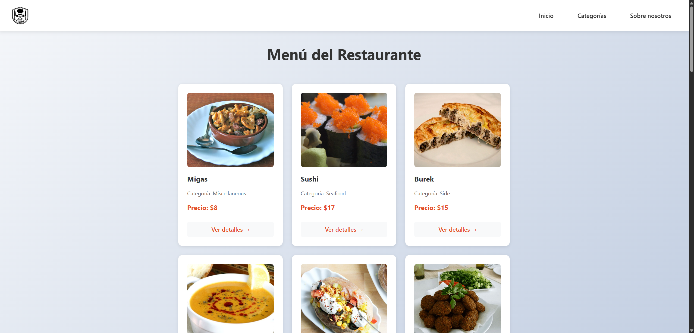
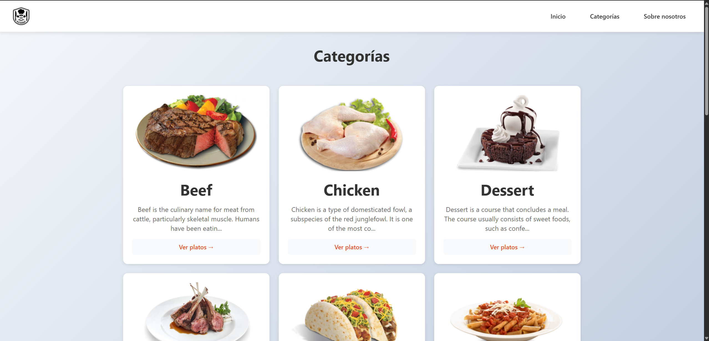
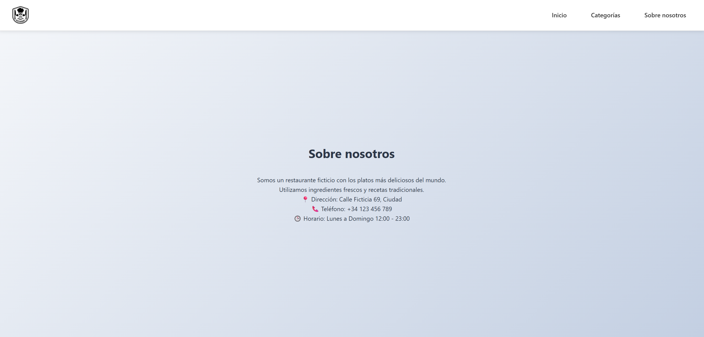
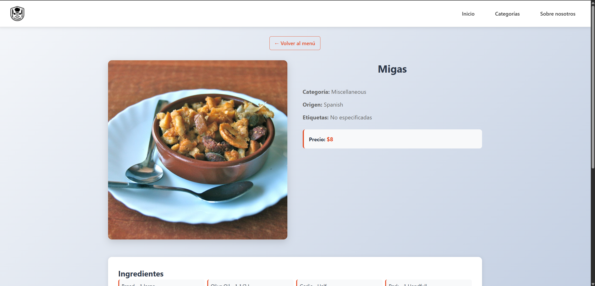
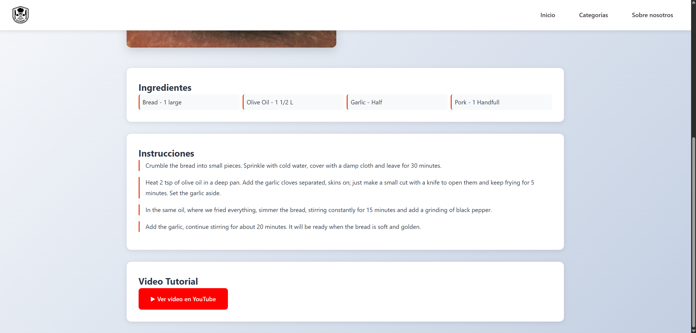

🍽️ React Restaurant – Menu and Order Management

📖 Overview

This web application developed with React allows managing a restaurant’s menu — displaying available dishes. You can add, update and delete new dishes in the project with the next structure shown below.

    src/
    │
    ├── components/
    │   ├── ContentLoading/
    │   │   ├── ContentLoading.css
    │   │   └── ContentLoading.jsx
    │   │
    │   ├── Loading/
    │   │   ├── Loading.css
    │   │   └── Loading.jsx
    │   │
    │   ├── MenuItem/
    │   │   ├── MenuItem.css
    │   │   └── MenuItem.jsx
    │   │
    │   ├── MenuList/
    │   │   ├── MenuList.css
    │   │   └── MenuList.jsx
    │   │
    │   ├── NavBar/
    │   │   ├── NavBar.css
    │   │   └── NavBar.jsx
    │
    ├── context/
    │   └── PriceContext.jsx
    │
    ├── hooks/
    │   ├── useLoading.jsx
    │   └── usePersistentPrices.jsx
    │
    ├── pages/
    │   ├── Categories/
    │   │   ├── Categories.css
    │   │   └── Categories.jsx
    │   │
    │   ├── CategoryDetail/
    │   │   ├── CategoryDetail.css
    │   │   └── CategoryDetail.jsx
    │   │
    │   ├── MealDetail/
    │   │   ├── MealDetail.css
    │   │   └── MealDetail.jsx
    │   │
    │   ├── About.jsx
    │   └── Home.jsx
    │
    ├── App.css
    ├── App.jsx
    ├── index.css
    ├── main.jsx
    │
    ├── .gitignore
    └── eslint.config.js

The main focus of the project is the interaction with an external API using fetch and async/await functions, ensuring efficient asynchronous operations and a smooth user experience.

🚀 Main Features

Dynamic visualization of the restaurant’s menu.

Consumption of a RESTful API to retrieve, create, update, and delete dishes.

Implementation of asynchronous functions with async/await.

Modern and responsive user interface built with React.

Reusable components for clean and maintainable code.

🧩 Technologies Used

Frontend: React 18, React Router

Language: JavaScript (ES6+)

Styling: CSS

API Handling: Fetch API

State Management: useState, useEffect

 Main page
 Categories
 About us
 Example dish
 Example dish 2